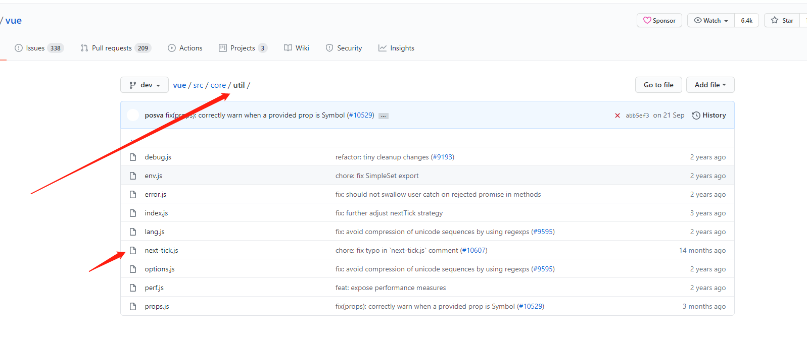

## 背景
看了网上无数的面经

隔鸡正式踏出了面试的一部，内心既忐忑，又兴奋，前面仿佛有着一个个offer在等着我

面试官：如果我想在Vue的created生命周期里访问到dom元素有什么办法？

隔鸡（想了想）：Vue的生命周期都是同步执行的，因此只要是异步的方法都能获取到dom元素,例如Vue的this.$nextTick

面试官笑了笑（这小子不错）：this.$nextTick你告诉我他做了什么？

隔鸡（心想给自己挖坑了，这可难不倒自己）：页面重新渲染、DOM更新后，VUE会立刻执行$nextTick，我们可以在$nextTick中传递回调函数来获取我们想要的值。同时也是为了性能优化，尤其是当你一个值重复赋值多次，页面也只会渲染一次，并不会渲染多次

面试官抬起头看了我一眼，（那小眼神分明带着淡淡的赞许，我从他那小眼神中看到，你小子行啊）：那this.$nextTick的原理你知道怎么实现的吗？

隔鸡内心万马奔腾，心想着这面试官不按常理出牌啊，一般不问到上一步就结束了吗，但这可难不倒隔鸡，隔鸡可是之前看过源码的：进行剖析源码


## download源码

隔鸡把Vue的源码download了下来



## 分析思路
next-tick.js 这个文件不是很大，只有一百多行，从next-tick.js文件里面看到了一些js关键方法，隔鸡看源码的时候都是抓取关键点看，如果一行行读能把眼睛看花了，因此抓取了一些关键点进行思路调整，可以看到下面有一块代码比较长的if语句判断 顺序就是下面的方法执行，

- 1、Promise->Promise.resolve()
- 2、MutationObserver
- 3、setImmediate 
- 4、setTimeout

上面这些方法都是异步任务，做了一层优雅降级处理（兼容），创建一个新的任务，
优先使用 Promise,如果支持Promise就执行Promise.resolve()，
如果浏览器不支持 则执行MutationObserver方法，如果不支持则执行setImmediate
如果再不支持，则执行setTimeout，也就是他是有一个优先级的执行顺序


## next-tick.js干了啥？
- 1、将异步操作的函数暂存起来
- 2、通过pending防止重复调用异步函数（类似防抖/节流）
- 3、对异步操作做兼容性处理


## 分析源码
```
import { noop } from 'shared/util'
import { handleError } from './error'
import { isIE, isIOS, isNative } from './env'

export let isUsingMicroTask = false

const callbacks = [] // 收集回调函数
let pending = false

function flushCallbacks () {
  // 将callbacks中的cb依次执行
  pending = false
  const copies = callbacks.slice(0)
  callbacks.length = 0
  for (let i = 0; i < copies.length; i++) {
    copies[i]()
  }
}
let timerFunc

// 1、优先考虑Promise实现
if (typeof Promise !== 'undefined' && isNative(Promise)) {
  const p = Promise.resolve()
  timerFunc = () => {
    p.then(flushCallbacks)
    if (isIOS) setTimeout(noop)
  }
  isUsingMicroTask = true
  // 2、降级到MutationObserver实现
} else if (!isIE && typeof MutationObserver !== 'undefined' && (
  isNative(MutationObserver) ||
  // PhantomJS and iOS 7.x
  MutationObserver.toString() === '[object MutationObserverConstructor]'
)) {
  let counter = 1
  const observer = new MutationObserver(flushCallbacks)
  const textNode = document.createTextNode(String(counter))
  observer.observe(textNode, {
    characterData: true
  })
  timerFunc = () => {
    counter = (counter + 1) % 2
    textNode.data = String(counter)
  }
  isUsingMicroTask = true
  // 3、降级到setImmediate实现
} else if (typeof setImmediate !== 'undefined' && isNative(setImmediate)) {
  timerFunc = () => {
    setImmediate(flushCallbacks)
  }
} else {
    // 4、如果以上都不支持就用setTimeout
  timerFunc = () => {
    setTimeout(flushCallbacks, 0)
  }
}

// nextTick 可以看到 就是把回调函数推入到了一个数组里面 ，当全部推入数组中后，就依次执行这些方法
export function nextTick (cb?: Function, ctx?: Object) {
  let _resolve
  callbacks.push(() => {
    if (cb) {
      try {
        cb.call(ctx)
      } catch (e) {
        handleError(e, ctx, 'nextTick')
      }
    } else if (_resolve) {
      _resolve(ctx)
    }
  })
  if (!pending) {
    pending = true
    timerFunc()
  }
  // $flow-disable-line
  if (!cb && typeof Promise !== 'undefined') {
    return new Promise(resolve => {
      _resolve = resolve
    })
  }
}
```
## 异步任务？
面试官问：上面看到你说了异步任务，那异步任务是什么呢？
异步任务又分为宏任务和微任务，
宏任务主要包含：script( 整体代码)、setTimeout、setInterval、I/O、UI 交互事件、setImmediate(Node.js 环境)
微任务主要包含：Promise、MutaionObserver、process.nextTick(Node.js 环境)

## 面试官又问隔鸡了，那为什么要采用这种方法呢？有什么好处呢
隔鸡到这一步可不怕了，

其实这是利用js的事件执行机制，即事件循环，JS是单线程，即主线程只有一个线程，同一时间片段内只能执行一个任务
优先考虑了具有高优先级的microtask，为了兼容，又做了降级策略。
- 在同一事件循环中，所有同步任务都在主线程上执行，形成一个执行栈，当所有的同步数据更新执行完毕后，
- 主线程之外，还存在一个"任务队列"，首先会第一个会去查看微任务队列中是否有事件要执行，如果有则清空所有的微任务事件
- 会去查看宏任务队列中是否有宏任务将要执行，如果有则推入事件队列中，则执行一个，继续上一次循环

## 总结
因此Vue 在修改数据后，视图不会立刻更新，而是等同一事件循环中的所有数据变化完成之后，再统一进行视图更新。


